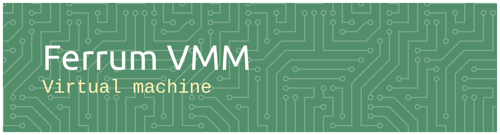

# FerrumVM

[](LICENSE)


**FerrumVM** is a hobby x86_64 VMM written in Rust using KVM, with a custom C-based UEFI firmware implementation capable of loading Limine and booting Linux with an Alpine Linux userspace. In its current form, it is able to boot custom UEFI firmware, which can be found under the `guest` folder, run a bootloader called Limine within this UEFI environment, and then boot the Linux kernel with an Alpine Linux userland on top of it.

## Why?

The main reason I built **FerrumVM** is because I love writing code that works at the hardware/software boundary. The issue is that when working with real hardware, it is often difficult to get firmware access to a device, let alone understand it deeply enough to write complete firmware for it.

When working with a virtual machine, however, you are provided with a unique opportunity to have complete control over the hardware that your virtual machine exposes. As a result, you are able to completely write your own firmware and hardware interfaces.

This is a big part of the reason I decided to build a UEFI firmware layer myself, because it is not a project that is usually possible for a developer working by themselves to undertake on real hardware. I could have easily used existing firmware such as EDK II's OVMF, or implemented the Linux boot protocol at the firmware level (the standard approach for performance-focused VMMs such as Firecracker), rather than using a bootloader and going through UEFI like I am doing at the moment. Doing it myself, however, means that i get to work with firmware in a way that is hard to do as an indivdual normally.

## How to use

The first step of running ferrum is to clone the repo:

```
git clone https://www.github.com/milosilo-dev/FerrumVM
cd FerrumVM
```

Then, you can use nix to get all of the dependancies on your system. (This might take a while)

```
nix develop
```

Now you are ready to build a valid image that the virtual machine can boot. The command bellow will copy the limine image passed as a parameter and copy it to the efi partition of the new disk. It also installs the linux kernel and rootfs as well as initramfs for the kernel when it boots.

```
sudo bash guest/image/mk_image.sh prebuilt/limine.efi
```

After that you are ready to run the virtual machine with

```
cargo run
```
If it works it should look like:

https://github.com/user-attachments/assets/9408d31c-a51b-41ee-931c-c8be3873740b

## The Host Side

The host side is written in Rust and has the role of managing vCPUs, handling VM exits, and emulating hardware devices to expose to the guest.

### Managing vCPUs

When managing vCPUs, KVM handles the bulk of the work, which means the code I have for this role is fairly standard compared to what other VMMs would do.

The main role of the vCPU struct in `vcpu.rs` is to set up the CPU registers initially before handing control over to my assembly stub. I have tried to design this aspect of the program to be scalable.

### Multi core
The VM also suports multipule vCPU's and allows them to handle VM Exits in parrelel, this allows for multicore within the virtual machine. THis is achived by running each vCPU's run loop in a diffrent operating system thread which menas i can leave it up to the host kernel to deside how the laod should be split across the physical cores availible.

### Handling VM Exits

When using KVM and other virtual machines, a **VM exit** occurs whenever the guest CPU needs the VMM to handle an operation that cannot be executed directly by the virtualised hardware.

This is much more efficient than handing control back to the VMM every CPU cycle because it massively improves performance and keeps most of the per-cycle logic inside the kernel. An example of something that might trigger a VM exit is when the guest CPU attempts to access an I/O port or perform an operation that requires emulation.

My implementation of this system involves a large `match` statement that covers every VM exit type supported by my VMM. It then calls out to another section of the program to handle the specific exit, which helps keep the amount of code in the main VM exit handler manageable.

## Emulating Devices

I have two different types of devices which cover most of what needs to be emulated. These are **MMIO devices** and **I/O devices**.

MMIO devices own a section of memory and are able to respond to all reads and writes that occur within those addresses. I/O devices, on the other hand, own a section of I/O ports which can be used to control a virtual device.

I use traits for each of these device types so that I can implement them independently, allowing each device to handle its own logic completely separately from the rest of the host. This makes the whole system easily expandable and allows it to support all manner of different devices.

The total list of devices that I support at the moment is:

- CMOS chip
- Serial device for communication
- Timer chip
- VirtIO BLK device (disk)
- VirtIO NET device (networking)
- VirtIO RNG device (randomness)
- VirtIO FS device (shared folder)

VirtIO is a protocol which allows devices to communicate through shared sections of memory rather than relying solely on the MMIO and I/O methods discussed earlier. I use it in FerrumVM for more complicated devices, such as block devices, which need to handle large amounts of shared memory.

FerrumVM implements VirtIO devices using virtqueues, allowing the guest and host to exchange buffers through shared guest memory rather than requiring an individual VM exit for every byte of I/O.

## Networking
As previously stated, networking in ferrum is done using the virtio-net protocol because its much simpler than emulating a real hadrware device. The networking device relys on a TAP device from the host kernel which allows from comuniction between host and guest at level 2 of the TCP-IP protocol.

The ethernet frames are moved back and forth on two seperate virtio queues, one for tx and one for rx. This allows for effishent transport of the frames between the guest and host.

On both the guest and host, there is setup that has too be done, like tying the network interface to an IP address and setting up packet forwarding from the host to the TAP Device.

## Shared folders
You are able to mount a shared fodler inside of the virtual machine using FUSE (File System in User Space), this allows for the virtual machine to have full acsess to the folder just the same as any other program on your computer. 

This is mainly used when compiling on the VM as the whole project does not need to be copied to the Disk Image and can be streamed in over Virtio instead.

## ACPI
I Generate custom ACPI tables from the host and inject them at a preditermined address, these are passed through to linux so it knows what hadrware to expect from the virtual machine. This includes mapping all the MMIO devices, their IRQ lines and their address range so that linux knows what it has been provided with.

I also map my VCPU's inside of the MADT tables, this tells the guest about what VCPU's are availible for it too bring up as well as how to send IRQ's to them seperatly.

## The Custom firmware

The guest side is written mainly in C, with a small assembly stub at the start to handle CPU mode transitions, moving from real mode to protected mode and then to long mode.

Once in the core of the C firmware, its main job is to find the bootloader on disk and execute its `BOOTX64.EFI` program. Doing this involves three steps:

### Finding and Reading the Binary

When finding the binary, I must be able to read both from the disk and from the filesystem that is written to the disk.

To do this, I first wrote a driver for my VirtIO BLK device, which allows me to read from and write to the disk. I then implemented the FAT32 filesystem format, which allows me to read the specific files and directories that are stored on the disk. This is what allows me to locate the binary that I am looking for.

Because UEFI applications use the PE/COFF executable format, FerrumVM includes a small PE/COFF loader capable of parsing the executable headers, locating sections, mapping them into guest memory, and transferring control to the EFI entry point.

### Creating a Suitable UEFI Environment

The entry point of this binary requires two arguments: the `EFI_SYSTEM_TABLE` and the `EFI_IMAGE_HANDLE`. `EFI_SYSTEM_TABLE` is a structure used to provide the bootloader with access to the UEFI firmware interface. `EFI_IMAGE_HANDLE` is an opaque pointer to the loaded image that is being executed.

All of the function pointers that are accessed by Limine have to be correctly filled out. Otherwise, when I execute the binary, it will simply break and something unexpected will happen, likely resulting in a jump into garbage memory.

Some exaples of function pointers which I implemnted are:
- filesystem access
- memory allocation
- protocol installation
- device paths
- loaded image protocol
- block I/O
- ACPI tables
- memory map

When filling out all of these functions, I had to write drivers for each of the existing hardware devices that the host implements so that the UEFI environment is able to correctly communicate with the virtual hardware.

Once the long process of implementing each required function was complete, Limine was finally able to boot.

### Providing a Root Filesystem for the Linux Kernel

Once I was inside Limine, it was not too difficult to get the Linux kernel booting because the Linux boot protocol is implemented by Limine and does not need to be implemented by me.

In order to do this i provided the kernel with:
- kernel image
- initramfs
- memory map
- serial device

What did require some thought was how I was going to structure the Alpine root filesystem for the kernel to access and boot into.

For this, I provide an initramfs which I point the Linux kernel to. From there, BusyBox is used to initialise the Alpine root filesystem, which provides the shell and user login that you see when running FerrumVM.

## What I Learned

The process of building this project was extremely valuable to me because not only is it a massive project which required months of dedication to finish, but it also exposed me to different aspects of computer science that I had never considered before.

Some of the topics that this project touched on where:
- How KVM exposes hardware virtualisation to userspace
- How x86 CPU modes transition from real mode to protected mode to long mode
- How UEFI applications are loaded and executed
- How PE/COFF executables are structured
- How FAT32 stores files and directories
- How VirtIO communicates through shared memory
- How Linux is bootstrapped through a bootloader
- How firmware interfaces are represented through ABI-compatible structures and function pointers

I also learned a lot of new methods for researching these topics, which are often not well documented on my typical platforms such as YouTube.

One resource that was tremendously helpful during the firmware stage of the project was the [UEFI specification](https://uefi.org/specs/UEFI/2.11/), which provided me with information about practically every function in the UEFI system table.

Another resource that I drew on alot was the [Virtio specification](https://docs.oasis-open.org/virtio/virtio/v1.3/virtio-v1.3.html), which I used to ensure I properly implement the devices so that they will play well with diffrent operating system drivers.

## Current Status

FerrumVM is currently capable of:

- [x] Booting an x86_64 guest using KVM
- [x] Running custom UEFI firmware
- [x] Reading a FAT32 filesystem
- [x] Loading PE/COFF EFI applications
- [x] Providing the UEFI interfaces required by Limine
- [x] Booting Limine
- [x] Booting the Linux kernel
- [x] Providing an Alpine Linux userspace
- [x] VirtIO block device
- [x] VirtIO RNG
- [x] VirtIO Net
- [x] VirtIO FS
- [x] Multi-Core
- [ ] VirtIO Gpu
- [ ] VirtIO Console
- [ ] PCI Support

## AI Usage

LLM's are a key tool that used for research during the project, they are realy good for sumerising protocols that I need to impelement. I made sure to limit the amount of code that is written by them however because this is my project and there is no benifit from having them do it all for them.

There is however, despit this, small sections written by AI. I have made sure to audit them up to my usual code standed, so they will not cause issues but i think its better to be trasparent about the usage than try to hide it.

## License

Licensed under the Apache License, Version 2.0. See [LICENSE](LICENSE).
